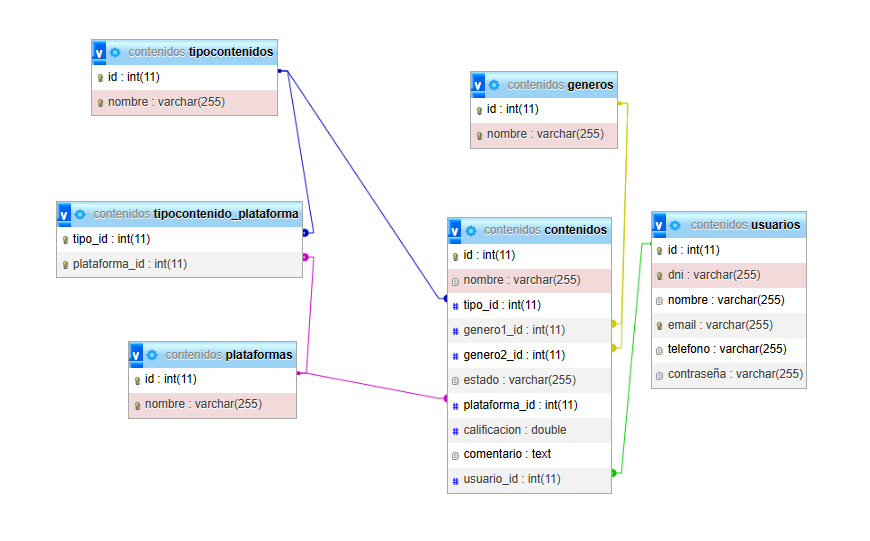

# Api Rest 🚀

En este proyecto de Spring boot se tiene como objetivo crear un API REST en java para una aplicacion que permita gestionar un sistema de control y calificacion de contenidos audiovisuales consumidos por el usuario. Este sistema es soportado por una base de datos a través de la cual se gestiona la informacion ingresada , y múltiples servicios que permitan la creación , consulta, modificacion y eliminación de registros.
 
## Especificaciones 📝

### Especificaciones funcionales 📦️

1. Se crean usuarios. Cada uno de los cuales tiene acceso únicamente a los contenidos creados por él mismo. También cuenta con la capacidad de modificar la información de su cuenta y borrar su perfil si así lo desea.

2. Cada usuario puede agregar a su lista contenidos audiovisual de cualquier tipo con los atributos correspondientes:


* #### Nombre

* #### Tipo contenido : Serie,Pelicula,Libro,Podcast,Videojuego,etc.

* #### Género: Accion,Aventura,Terror , etc.

     #### Nota: 🚨
    ````
        El usuario podrá asignar hasta 2 géneros distintos
    ````

* #### Estado Visualización: Pendiente, Viendo, Terminado , Abandonado, En Pausa.

* #### Plataforma

* #### Calificacion 

* #### Comentario


#### Nota: 🚨
```
 Durante la creacion de registros , los campos de 
 "Calificación " y "Comentario" se habilitarán únicamente 
 si el estado de asignado es "Terminado" o "Abandonado"
```

3. La aplicación ya cuenta con atributos por defecto, pero en caso de que el usuario desee agregar nuevos tipos de contenido, géneros y plataformas.

4. Las plataformas disponibles para asignar deben depender del tipo de contenido.

5. Los usuarios deben estar en capacidad de consultar la totalidad de registros que tengan en su lista, así como ordenar o filtrar resultados de su busqueda según los atributos indicados en el numeral 2.

6. Desde la consulta de contenidos el usuario tiene una opción de seleccionar un registro para editarlo, en caso de actualizar el estado de visualización a "terminado" o "Abandonado" se deberá habilitar la opcion de registrar una calificacion y un comentario. De igual forma se tiene la opción de eliminar el registro en caso de así desearlo.


### Especificaciones técnicas 🧑‍💻

* La aplicacion se creo en Spring Boot (3.2.3) y java (JDK 17).

* Se utilizo Spring Data JPA para mapear entidades.

* Se implementa con documentacion con Swagger.

* Utlizacion de JPQL en consultas necesarias

* Se manejas excepciones propias.

* Se implementa Spring Security con JWT para todos los endpoints que no sean de autenticación.

* Configuración de CORS.

* Se utiliza principios de diseño SOLID

* Se implementa fundamentos POO.

* Cuenta con una organización que separa los componentes de la aplicacion utilizando clases de diferentes tipos.


### Modelo de base de datos

